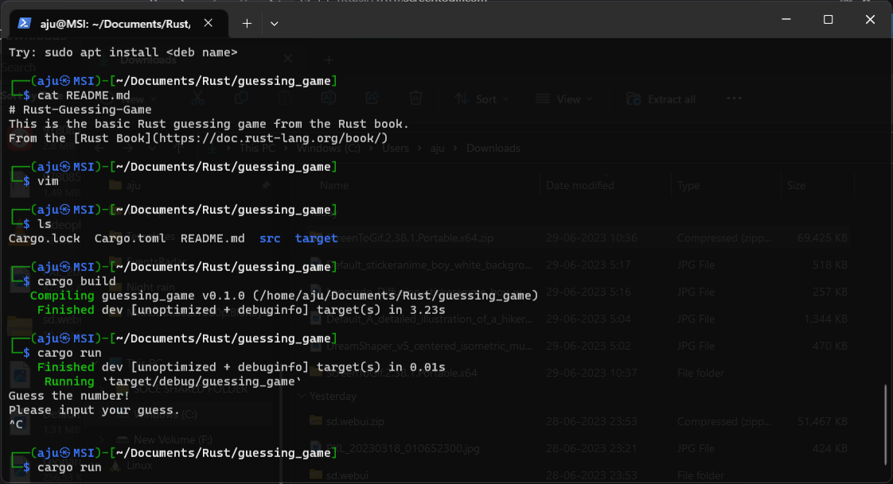

# Rust Guessing Game

This is a simple guessing game implemented in Rust. It is based on the example provided in the Rust Book, a comprehensive guide to the Rust programming language.

## Gameplay

The game generates a random number between 1 and 100, and the player's objective is to guess the correct number. The player is given hints about their guess being too high or too low, helping them to narrow down the correct answer. The game continues until the player guesses the correct number.

## Demo




## Technologies Used

The Rust Guessing Game utilizes the following technologies:

- **Rust**: The programming language used to write the game. Rust is known for its emphasis on memory safety, concurrency, and performance.

## How to Run

To run the Rust Guessing Game on your machine, follow these steps:

1. Install Rust: If you haven't already, you'll need to install Rust on your system. Visit the official Rust website at [https://www.rust-lang.org/](https://www.rust-lang.org/) and follow the instructions for your operating system.

2. Clone the Repository: Clone the Rust Guessing Game repository to your local machine using Git or download it as a ZIP file and extract it.

3. Navigate to the Project Directory: Open a terminal or command prompt and navigate to the directory where you cloned or extracted the repository.

4. Build and Run the Game: Enter the following command in the terminal to build and run the game:

   ```bash
   cargo run
   ```

   This command will compile the Rust code and execute the game.

5. Play the Game: Follow the prompts on the screen to enter your guesses and see if you can correctly guess the random number.

## License

The Rust Guessing Game is open-source and distributed under the [MIT License](LICENSE). Feel free to modify and distribute the game according to the terms of the license.

## Acknowledgements

The Rust Guessing Game is based on the example provided in the Rust Book. The Rust Book is an excellent resource for learning the Rust programming language and is available at [https://doc.rust-lang.org/book/](https://doc.rust-lang.org/book/).

